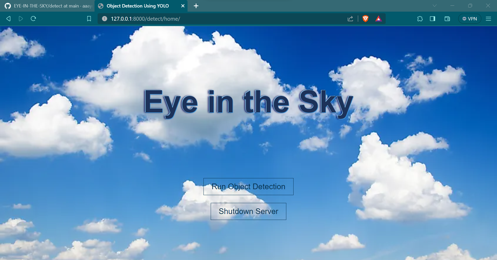
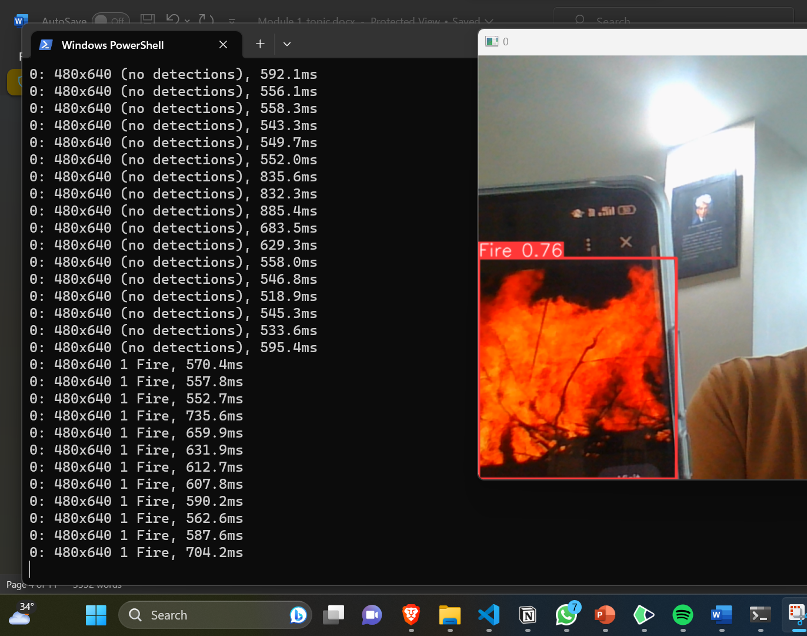

# EYE_IN_THE_SKY-final

So in this file, the folder titled 'eye_in_the _sky_django' is a django project which can be imported and ran on a local server. 
You can clone the repo and then in your command line go to the project and run the command 

python manage.py runserver

As the manage.py file is present in te project itself.
Then on the local address go to "/detect/home"
and you will see something like this

After that when you  click on 'Run Object Detection', after waiting a litle while the python object detection will start though your webcam to appear somethins like this

On getting the object detection to work you can close the server by clicking on  "Shut Down Server" visible in the "detect/home" page
